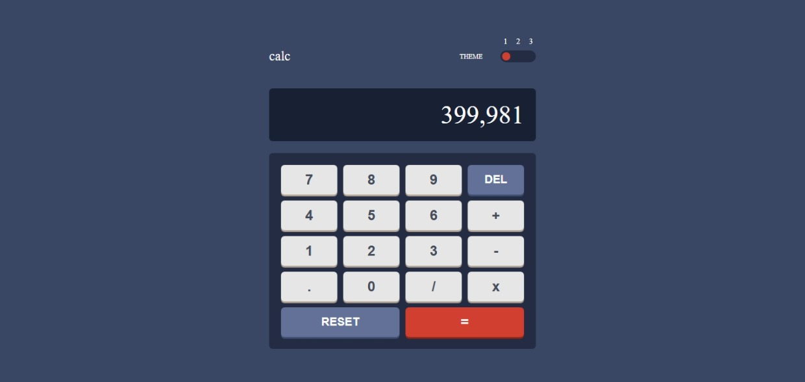

## Table of contents

- [Overview](#overview)
  - [The challenge](#the-challenge)
  - [Screenshot](#screenshot)
- [My process](#my-process)
  - [Built with](#built-with)
  - [What I learned](#what-i-learned)
  - [Continued development](#continued-development)
  - [AI Collaboration](#ai-collaboration)

## Overview

### The challenge

Users should be able to:

- See the size of the elements adjust based on their device's screen size
- Perform mathmatical operations like addition, subtraction, multiplication, and division
- Adjust the color theme based on their preference

### Screenshot

## Live Demo

- **Live Site URL:** [View Live Demo] https://danny17bobd.github.io/calculator/
  
## My process

### Built with

- Semantic HTML5 markup
- CSS custom properties
- Flexbox
- CSS Grid
- Mobile-first workflow
- [Styled Components](https://styled-components.com/) - For styles

### What I learned

- **State Management in Vanilla JS:** Mastered managing application state (tracking current inputs, previous numbers, and selected mathematical operators) cleanly without relying on external UI frameworks.
- **Dynamic Theming with CSS Variables:** Implemented a scalable multi-theme architecture using CSS Custom Properties (`var(--...)`) toggled at the HTML root element via `data-theme` attributes.
- **UX & Input Validation:** Standardized input sanitization logic to handle real-world edge cases gracefully—such as preventing multiple decimal points in a single operand, handling division by zero, and supporting sequential operations without pressing equals.

### Continued development

In future iterations of this project, I plan to expand its functionality by focusing on the following areas:

- **Calculation History Log:** Add a collapsible side drawer to store past equations, allowing users to recall or clear their calculation history.
- **Scientific Calculator Mode:** Build an expandable panel offering advanced functions (such as square roots, exponentiation, trigonometric functions, and percentages).
- **Unit Testing:** Implement automated unit tests using Jest to verify mathematical logic across all edge cases before deployment.

### AI Collaboration

During the development and polishing phase of this project, I leveraged AI collaboration (Gemini) as a pair programmer to:

- **Code Review & Edge Case Analysis:** Refine mathematical state logic and ensure key events (like continuous operator inputs) were handled cleanly.
- **Documentation & Presentation:** Structure a professional, standardized `README.md` and curate project showcase highlights for onboarding submissions.
- **Asset Optimization:** Evaluate headshot photos and refine personal media assets to present a polished professional profile.
